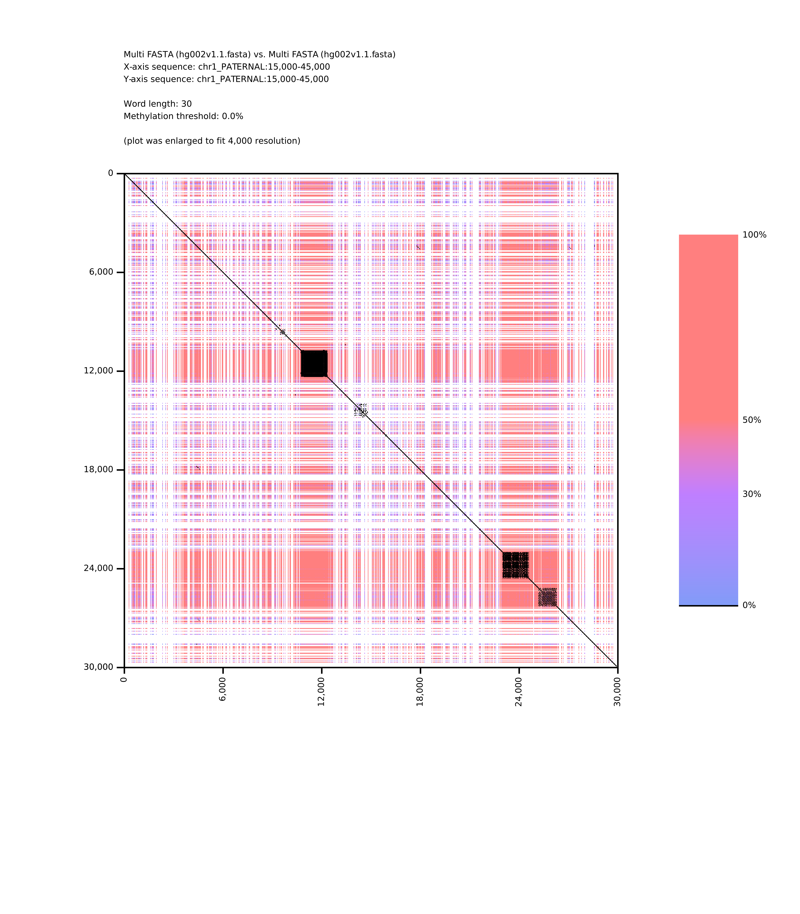
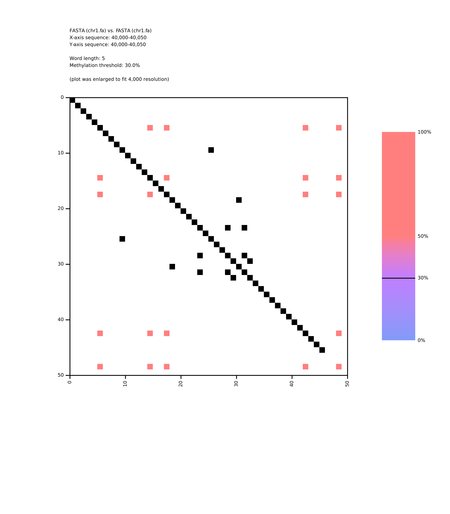

# About
_Epidotplot_ is a DNA sequence visualization tool, generating single-sequence or pairwise dotplots with optional visualization of cytosine methylation data.
It accepts FASTA/MultiFASTA sequences (with optional reverse-complement transformation), integrates bedMethyl/BedGraph methylation tracks, and produces plots that highlight sequence similarity, structural features, and methylation patterns. It also allows restricting the visualization to selected regions of sequences.

# Platform support
_Epidotplot_ is developed and tested on Linux systems; behavior on other operating systems may differ.

# Installation
```
# install
cargo install --git https://github.com/xhabararb/epidotplot.git \
--locked

# uninstall
cargo uninstall epidotplot
```

# Building from source
```
# optionally clone
git clone https://github.com/xhabararb/epidotplot.git

cd epidotplot
cargo build --release

# run
target/release/epidotplot --help
```

# Installation from local
```
# optionally clone
git clone https://github.com/xhabararb/epidotplot.git

cd epidotplot
cargo install --path . --locked

# run
epidotplot --help

# uninstall
cargo uninstall epidotplot
```

# Usage
Single-sequence mode
```
epidotplot plot --sequence <fasta file> [--methylation <bed/bedgraph file>] [OPTIONS]
```
Pairwise mode
```
epidotplot plot --fst-sequence <fasta file> --snd-sequence <fasta file> [--fst-methylation <bed/bedgraph file> --snd-methylation <bed/bedgraph file>] [OPTIONS]
```

`--sequence` (single) or `--fst-sequence` + `--snd-sequence` (pairwise)  
are the only required arguments.
Methylation input is optional but recommended for epigenetic visualization.
# Modes
## Single-sequence mode
### **Sequence input**
Provide a single FASTA or MultiFASTA file through `--sequence <fasta file>`.
If the file contains multiple sequences, they are concatenated in original order within the file to produce one continuous sequence.
This final sequence is then used for both axes (x and y) to generate an identity plot.
### **Methylation input**
Optionally provide methylation data with `--methylation <bed/bedgraph file>`.
The file must reference the same identifier(s) and coordinate system as the(Multi)FASTA input.
### Region selection
Use `--region <region>` to restrict plotting to a specific part of the sequence.  
See **Region selection** for syntax and details.
### Reverse complement
Reverse-complement flags `--fst-rev` (x-axis) and `--snd-rev` (y-axis) can be used to independently transform one or both axis-specific sequences.

---
## Pairwise mode
### Sequence input
Provide two sequences:
- `--fst-sequence <fasta file>` for the x-axis sequence.
- `--snd-sequence <fasta file>` for the y-axis sequence.

Both accept FASTA or MultiFASTA.  
If MultiFASTA is used, sequences are concatenated according to the file order.
### Methylation input

If methylation is included, both sides must be provided together:
- `--fst-methylation <bed/bedgraph file>`
- `--snd-methylation <bed/bedgraph file>`

Each file must match the identifiers and coordinate system of its corresponding sequence.
### Region selection
Specify a region of interest for both axes using:
- `--region <region>`
  or separately:
- `--fst-region <region>` (x-axis)
- `--snd-region <region>` (y-axis)
  See **Region selection** for syntax interpretation.
### Reverse complement
Same as in single-sequence mode.
`--fst-rev` and `--snd-rev` operate on the axis data independently.

---
## Region selection
A region specification restricts which portion of the input sequences is used for plotting.
Regions may be given once for both axes (`--region`) or per axis (`--fst-region` (x-axis), `--snd-region` (y-axis)).  
Regions support three forms:
### Types
#### ID
e.g. `--region chr1`
Selects the entire sequence with this identifier.  
ID must match a FASTA header (and methylation identifier, if used).
#### START-END
e.g. `--region 0-20`
A global interval on the (concatenated) sequence.
Coordinates are 0-based, half-open (start inclusive, end exclusive).

#### ID:START-END
e.g. `--region chr1:0-20`
A local interval within a specific sequence ID.  
Coordinates are 0-based, half-open, and relative to that ID sequence (as opposed to the global concatenation).

Empty or incomplete specifications are rejected: `""`, `":"`, `":10-20"`, etc.

---
# FASTA input format
The program accepts FASTA and MultiFASTA as sequence input.  
When MultiFASTA is used, entries are concatenated in file order.
## Rules
- Allowed nucleotide characters: A, C, G, T, N (case-insensitive).
- Any k-mer containing N is skipped entirely during dotplot computation.
- Other characters, including gaps `-`, are not supported (if possible, use N).
- Lines beginning with `;` are treated as comments and ignored.
- Each header begins with `>` and the identifier is the text immediately following it (trailing whitespace is trimmed).

---
# Methylation input
Methylation data are optional.  
Supported formats: bedMethyl and bedGraph.
Both formats consist of space-delimited columns, one record per line.
## Expected formats
### bedMethyl
The following fields are processed:
- chrom (1st column) - the sequence identifier
- chromStart (2nd column) - the starting position
- chromEnd (3rd column) - the  ending position (must equal chromStart + 1)
- Percent Modified (11th column) - percent of valid calls that are modified

Columns 4–10 are only checked for presence and are otherwise ignored; columns after 11 may be omitted altogether as they are not checked nor read.
### bedGraph
Format:  
`chrom chromStart chromEnd dataValue`  
Same semantics as above.

For both formats, coordinates are 0-based, `chromStart` is the actual 0-based position in the reference sequence.
## General rules
- Only single-base cytosine methylation is accepted (`end = start + 1`).
- If the referenced nucleotide is not C, the program errors (or warns and skips with `--forgiving` flag set).
- Values are interpreted as:
	- fractions if all values ∈ [0,1]
	- otherwise percentages with values ∈ [0,100]
- Values outside these ranges cause an error.
- Methylation identifiers must match FASTA identifiers.
## Other settings:

`-m / --methylation-threshold <float>`
A percentage (0-100) threshold for considering a site methylated, lower values are ignored.  
Default: 0 (no filtering).

`-w / --word-length <int>`
Specifies the k-mer (word) size used for searching and exact matching in sequences.  
Default: 21.  
Must satisfy `1 ≤ k ≤ sequence length`.  
A smaller value increases sensitivity but also introduces substantial noise; when too small the plot may become cluttered or even unreadable.  
A larger value reduces noise but may remove fine structure, and if too large relative to the sequences, no matches may appear at all.
K-mers containing unspecified nucleotide `N` are skipped.
### Plot scaling and rendering

`--plot-side <int>`
Target size (in pixels) of the plot’s longer axis.  
The shorter axis is scaled proportionally.  
Default: 4000 px.  
Accepted range: 350–12 500 px.

`--enlarge-small`
If the computed plot resolution is below the target (common for short sequences or due to integer division effects), enabling this flag stretches the plot to the requested size.  
When enlargement occurs, a comment is added to the plot indicating that scaling occurred.  
This is usually a good idea to use.

`--dot-size <int>`
Specifies the pixel size of a unit dotplot dot (applies to both black sequence dots and colored methylation dots).  
Default: 1 (no enlargement).  
Black sequence dots are always drawn over the methylation dots.
When enlarged, colored dots are averaged, whereas black dots are duplicated.

---

`-c`/`--config-file <JSON file>`
Loads parameters from a JSON file.  
CLI flags override JSON values.  
Keys use the long-form names (e.g., `"word-length"`, not `"w"`).

`-p / --parallel <bool>`

Enables parallel computation.  
Disabled by default; when off, all computation runs sequentially.

`-o / --output-dir <dir>`

Directory where plots and other data are written.  
Defaults to the current working directory.
Output is a PNG raster image.

# Examples
```
epidotplot plot \
--sequence hg002v1.1.fasta \
--methylation 5mC.bed \
--region chr1_PATERNAL:15000-45000 \
-o out --word-length 30 -d 4 --parallel --enlarge-small

[00:00:01]   finished parsing sequence data              
[00:00:46]   finished parsing methylation data 
[00:00:00]   finished building suffix array and LCP array     
[00:00:00] [########################################] 851/851 first methylation: binning dots                      
[00:00:00] [########################################] 851/851 second methylation: binning dots                     
[00:00:00] [########################################] 518400/518400 averaging dots                                
[00:00:00] [########################################] 3750/3750 calculating similarity between k-mers (parallel)   
rendering image...
plot saved as PNG to out/chr1_PATERNAL_15000-45000__chr1_PATERNAL_15000-45000.png
```



```
epidotplot plot \                             
--fst-sequence chr1.fa \
--snd-sequence chr1.fa --fst-region 40000-40050 --snd-region 40000-40050 \
--fst-methylation chr1.bed \
--snd-methylation chr1.bed \
-w 5 -m 30 \
-o out --parallel --enlarge-small

[00:00:01]   finished parsing sequence data                                                                        
[00:00:04]   finished parsing methylation data
[00:00:00]   finished building suffix array and LCP array
[00:00:00] [########################################] 5/5 first methylation: binning dots 
[00:00:00] [########################################] 5/5 second methylation: binning dots 
[00:00:00] [########################################] 25/25 averaging dots                                    
[00:00:00] [########################################] 50/50 calculating similarity between k-mers (parallel) 
rendering image...
plot saved as PNG to out/40000-40050__40000-40050.png 
```


